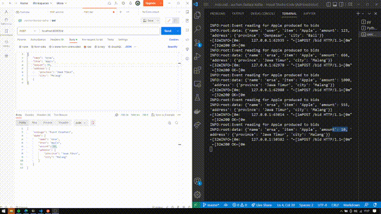

# Auction Data Streaming
  

This is a project that trying to build a streaming data service. Using FastAPI to generate events every time users send requests into some endpoints. For the streaming data platform, this project used [Confluent Kafka](https://www.confluent.io/home/) and utilize its services like Schema Registry, ksqlDB, and Kafka Connect. Then, for storing and analyzing the created events, I integrate specific Kafka topic into BigQuery.

note for me for further reference:
- specify the topic key if you are concerned with events ordering (storing in the same partition) and create the most suitable key because when I sink into the topic into BigQuery the key is not included as a message.
- Dont overuse ksql to create analytical queries (CMIIW, I just heard it from the expert but it makes sense)

## Prerequisites and requirements
to install all the dependencies:
`pip install -r requirements.txt`

### Modifying config .py
First copy the [config.py.example](./config.py.example) into config.py and fill out all the required API keys from [confluent console](https://confluent.cloud/)

### ksqlDB 
create ksqlDB stream as a consumer to the topic we produced in endpoints for further data processing.
**Create stream in ksql**
```sql
CREATE STREAM bids (
  name VARCHAR,
  item VARCHAR KEY,
  amount INT, 
  address STRUCT <
    province VARCHAR, 
    city VARCHAR >
) WITH (
  KAFKA_TOPIC = 'bids',
  PARTITIONS = 1,
  VALUE_FORMAT = 'avro'
);
```
**Trasform stream schema**
```sql
CREATE STREAM bids_formatted AS
select item,
       name,
       amount,
       address -> province, 
       address -> city,
       TIMESTAMPTOSTRING(ROWTIME, 'yyyy-MM-dd HH:mm:ss', 'GMT+7') AS timestamp 
from bids;
```
### How To Run
because FastAPI uses uvicorn as web server, you can run it by 
```
uvicorn app.main:app
or
uvicorn app.main:app --reload
```

### Endpoint
`/autobid`: auto generating events  
```json
{
    "frequency": 10
}
```

`/bid`: make an event  
```json
{
    "name": "ersa",
    "item": "Apple",
    "amount": 99,
    "address": {
        "province": "Jawa Timur",
        "city": "Malang"
    }
}
```
## References
- [Kafka Fundamental - Programmer Zaman Now](https://youtube.com/playlist?list=PL-CtdCApEFH8dJMuQGojbjUdLEty8mqYF)
- [Kafka Fundamental - Confluent](https://www.youtube.com/playlist?list=PLa7VYi0yPIH2PelhRHoFR5iQgflg-y6JA)
- [Kafka usecase](https://www.youtube.com/watch?v=posIZrz-m7s)
- [ksqlDB - Confluent](https://developer.confluent.io/courses/ksqldb/intro/)
- [kafka project - Subham Kumar](https://subham-sahoo.medium.com/live-data-streaming-project-using-kafka-part-1-9e7553c70b1)
- [Build app with kafka and python - Confluent](https://www.youtube.com/watch?v=jItIQ-UvFI4)
